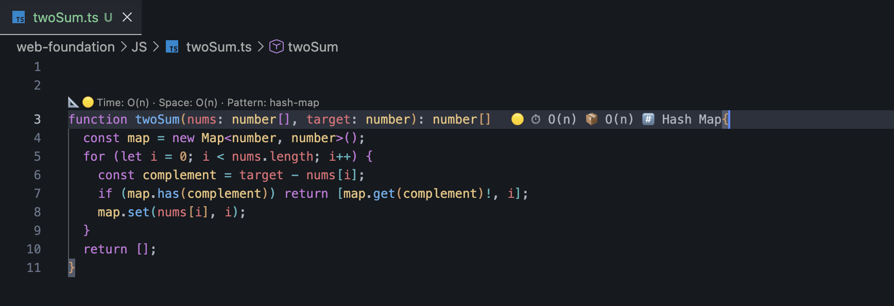
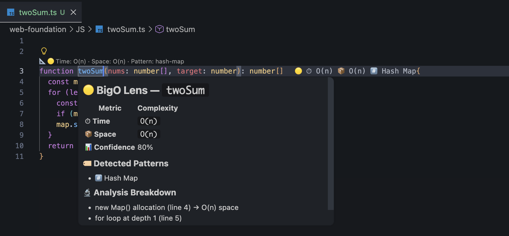

<div align="center">


# BigO Lens

### 🔍 Instant Big-O Time & Space Complexity — Right Inside VS Code

**No AI. No API. No internet. Just pure static analysis, as you type.**

<br/>

[](https://marketplace.visualstudio.com/items?itemName=YTTHEMIGHTY.bigo-lens)
[](https://marketplace.visualstudio.com/items?itemName=YTTHEMIGHTY.bigo-lens)
[](https://github.com/YTTHEMIGHTY/bigo-lens)
[](LICENSE)

</div>

---

## 💡 The Problem It Solves

You're deep in a DSA session. You've written a solution. But you have a nagging question:

> *"Is this `O(n²)` or `O(n log n)`? Should I rewrite this?"*

You could:
- ❌ Context-switch to a browser and paste your code into an AI chatbot
- ❌ Open an external profiler and manually run your function with large inputs
- ✅ **Just look above your function in VS Code — BigO Lens already told you**

BigO Lens eliminates that friction entirely. It's built for engineers who want instant, accurate, offline Big-O analysis woven directly into their development workflow.

---

## 🖼️ See It In Action

**Inline annotation — real-time, zero config, directly on your code:**



**Hover card — full analysis breakdown on demand:**



> Both views update **live as you type** — no commands, no build step, no internet.

---

## ⚡ Why BigO Lens is Different

> This is the most important section if you're evaluating this extension.

Most tools that claim to analyze complexity fall into one of two camps:

### 🤖 Camp 1: AI/LLM-Based Tools
These send your code to a cloud API (ChatGPT, Gemini, etc.) and ask it to *guess* the complexity.

**Problems:**
- Requires an internet connection
- Has latency (300ms–2000ms per request)
- Non-deterministic — same code can get different answers on different runs
- Leaks your code to a third-party server
- Doesn't understand your *actual* runtime structure

### 📊 Camp 2: Empirical Runtime Profilers
These *actually run* your function with increasingly large inputs, measure execution time, and fit a mathematical curve to the data.

**Problems:**
- Cannot run in your editor while you're typing
- Requires internet or a dedicated tool
- Only gives you *average-case, empirical* performance — not the theoretical worst-case Big-O that interviews expect
- Can be fooled by JIT optimizations and V8 engine caching

---

### 🔬 BigO Lens: Camp 3 — Pure AST Static Analysis

BigO Lens uses a fundamentally different approach: it reads your code the same way a **compiler does**, by constructing an Abstract Syntax Tree (AST) and traversing its logical structure.

```
Your Code → TypeScript Compiler API → AST Walk → Pattern Matching → Big-O Result
```

It never runs your code. It understands it.

---

### 📋 Scenario Comparison Table

| Scenario | Runtime Profilers | AI-based Tools | **BigO Lens** |
|---|:---:|:---:|:---:|
| Works offline | ❌ | ❌ | ✅ |
| Zero latency | ❌ | ❌ | ✅ |
| Works while typing | ❌ | ❌ | ✅ |
| Deterministic (same code = same answer) | ⚠️ | ❌ | ✅ |
| Code stays on your machine | ✅ | ❌ | ✅ |
| Theoretical worst-case (interview standard) | ❌ | ⚠️ | ✅ |
| Detects hidden `O(n log n)` from `.sort()` | ✅ | ⚠️ | ✅ |
| Detects nested implicit loops (`.map` in loop) | ✅ | ⚠️ | ✅ |
| Handles early-exit (`break`) scenarios | ✅ | ⚠️ | ⚠️ Reports worst-case |
| Handles amortized `O(1)` (HashMap ops) | ✅ | ⚠️ | ⚠️ Conservative |

> ⚠️ **Design trade-off:** BigO Lens intentionally reports the **theoretical worst-case** — which is exactly the standard used in technical interviews (FAANG, LeetCode, etc.). For empirical average-case analysis, a runtime profiler is the right tool. For real-time, interview-standard annotations in your editor — BigO Lens is.

---

### 🔍 Real-World Examples Where They Diverge

**Example 1: Hidden sort**
```typescript
function findKthLargest(nums: number[], k: number): number {
  return nums.sort((a, b) => b - a)[k - 1]; // ← looks O(1) after sort
}
```
- Runtime profiler: Measures ~`O(n log n)` empirically ✅
- BigO Lens: Detects `.sort()` in AST → Reports `O(n log n)` ✅

**Example 2: Implicit nested loop**
```typescript
function hasDuplicate(arr: number[]): boolean {
  return arr.some((val, i) => arr.indexOf(val) !== i); // ← `.indexOf` is O(n) inside `.some`
}
```
- Runtime profiler: Measures ~`O(n²)` empirically ✅
- AI tool: Might say `O(n)` because it misses the hidden loop ❌
- BigO Lens: Detects nested array method calls → Reports `O(n²)` ✅

**Example 3: Two Pointer optimization**
```typescript
function twoSum(nums: number[], target: number): number[] {
  let left = 0, right = nums.length - 1;
  while (left < right) { /* single traversal */ }
  return [];
}
```
- BigO Lens: Single `while` loop → `O(n)` ✅, no extra allocations → `O(1)` ✅

---

## ✨ Features

### 🏷️ Inline Complexity Annotations
See `⏱ O(n) 📦 O(1)` right after your function signature in real-time. Zero configuration, zero delay.

### 🎨 Color-Coded Severity
Instantly know if your solution is optimal:
- 🟢 **Optimal** — `O(1)`, `O(log n)`
- 🟡 **Acceptable** — `O(n)`, `O(n log n)`
- 🟠 **Warning** — `O(n²)`, `O(n³)`
- 🔴 **Critical** — `O(2ⁿ)`, `O(n!)`

### 📐 Smart CodeLens
Clickable complexity summary **above every function** showing:
- Time & space complexity with color-coded severity icon
- Detected algorithmic pattern
- LeetCode problem link (when applicable)
- **Click** any CodeLens entry to get a quick pop-up summary of Time, Space, and detected patterns instantly

### 🏷️ Algorithm Pattern Detection
Automatically identifies which technique you're using:

| Pattern | Detected |
|---|---|
| 🎯 Two Pointer | ✅ |
| 🪟 Sliding Window | ✅ |
| 🔍 Binary Search | ✅ |
| 🌊 BFS (Breadth-First Search) | ✅ |
| 🌲 DFS (Depth-First Search) | ✅ |
| 📊 Dynamic Programming | ✅ |
| ✂️ Divide & Conquer | ✅ |
| 💰 Greedy | ✅ |
| ↩️ Backtracking | ✅ |
| #️⃣ Hash Map | ✅ |
| 📖 Sorting | ✅ |
| 📚 Stack | ✅ |
| ⛰️ Heap / Priority Queue | ✅ |
| 🔗 Linked List | ✅ |
| 💪 Brute Force (fallback) | ✅ |

### 💡 Optimization Hints
When complexity exceeds the threshold, BigO Lens suggests specific improvements — shown in **three places**:
1. In the **hover card** when you hover over the function
2. As **VS Code diagnostic squiggles** on the function declaration line
3. In the **Problems panel** (`Ctrl+Shift+M`) as expandable related information

```
⚠️ O(n²) detected — nested loop over same array
💡 Consider: HashMap lookup to reduce to O(n)
💡 Consider: Sorting + two pointers for O(n log n)
```

### 🔗 LeetCode Integration (100+ Problems — Fully Offline)
If your function name matches the pattern `<name>_<number>` (e.g., `twoSum_1`, `containerWithMostWater_11`), BigO Lens:
- Auto-resolves the **problem name** and **LeetCode URL**
- Shows the **known optimal Time & Space** for that problem
- Tells you if your solution **matches the optimal** ✅ or **can be improved** ⚠️
- **Clicking the link opens the problem in your browser** directly from VS Code

> 📦 **100+ problems built-in** from the Blind 75 and NeetCode 150 lists — bundled inside the extension for **zero-latency, fully offline** resolution. No internet required.

### 📊 Confidence Score
Every analysis comes with a **Confidence %** — BigO Lens's self-reported certainty about its result.

```
📊 Confidence  80%
```

This is calculated from how many **structural signals** the AST analyzer found in your function:

| Signal Found | Confidence Boost |
|---|---|
| Loop detected | +15% |
| `.sort()` call detected | +15% |
| HashMap/Set allocation | +10% |
| Self-recursion detected | +10% |
| Function has parameters | +5% |
| Ambiguous multi-branch recursion | -10% |

**What it means in practice:**
- **90–100%** — Multiple clear structural signals. Very reliable.
- **70–89%** — Good structural evidence. Result is likely accurate.
- **50–69%** — Fewer signals. Function may have runtime edge cases (early exits, amortized ops) not visible to the AST.
- **< 50%** — Very simple or ambiguous function — treat as a conservative estimate.

> ℹ️ BigO Lens always reports **theoretical worst-case** (the interview standard). A lower confidence means there could be practical optimizations (like early `break` exits or amortized `O(1)` HashMap operations) that a runtime profiler would catch but static analysis cannot guaranteed from code structure alone.

### 📄 Complexity Report
Generate a Markdown complexity report for all functions in your file — perfect for review.

**Command:** `BigO Lens: Export Complexity Report`

---

## 🧪 How It Works (Technical)

### ⚡ Debounced Live Analysis
BigO Lens analyzes your file automatically as you type, with a **500ms debounce** — so it never runs on every single keystroke, keeping your editor responsive while still feeling instant.

### 🗃️ Smart Content-Hash Cache
Analysis results are cached using a **djb2 content hash** as the key. If you switch between files or scroll away and back, the result is served instantly from cache — no re-parsing. The cache holds up to 200 entries and auto-evicts on overflow.

### 🔍 AST Pattern Detection

| Code Pattern | Time Complexity |
|---|---|
| Single `for`/`while` loop | `O(n)` |
| Nested loops (2 levels) | `O(n²)` |
| Nested loops (3 levels) | `O(n³)` |
| `.sort()` call | `O(n log n)` |
| Binary search (`left/right/mid` pattern) | `O(log n)` |
| Halving loop (`i /= 2`, `i >>= 1`) | `O(log n)` |
| Direct recursion (no memo) | `O(2ⁿ)` |
| Recursion + memoization | `O(n)` |
| Divide-and-conquer recursion (2 calls, halving) | `O(n log n)` |
| `.forEach()`, `.map()`, `.filter()`, `.indexOf()` | `O(n)` per level |
| `Object.keys()`, `Array.from()`, `.concat()`, `.slice()` | `O(n)` |

| Allocation Pattern | Space Complexity |
|---|---|
| `new Map()` / `new Set()` / `new WeakMap()` | `O(n)` |
| `new Array(n)` / `.push()` / `.unshift()` | `O(n)` |
| `.slice()` / `.concat()` (creates copies) | `O(n)` |
| 2D DP table (`Array.from(...Array(...))`) | `O(n²)` |
| No extra allocations | `O(1)` |
| Recursive call stack (non-dividing) | `O(n)` |
| Recursive call stack (dividing) | `O(log n)` |

---

## 📦 Installation

### From VS Code Marketplace
1. Open VS Code
2. Press `Ctrl+Shift+X` (or `Cmd+Shift+X` on macOS)
3. Search for **"BigO Lens"**
4. Click **Install**

### From Command Line
```bash
code --install-extension YTTHEMIGHTY.bigo-lens
```

---

## 🚀 Quick Start

1. **Open any `.ts` or `.js` file** with algorithm functions
2. **Look above your function** — you'll see a CodeLens with complexity
3. **Look at the function signature line** — inline hints show `⏱ O(n) 📦 O(1)`
4. **Hover over the function name** — see a detailed breakdown
5. **Run the report command** to export a full analysis

No configuration needed — works out of the box!

---

## ⚙️ Configuration

All settings are optional. BigO Lens works with sensible defaults.

| Setting | Default | Description |
|---------|---------|-------------|
| `bigoLens.enabled` | `true` | Enable/disable the extension |
| `bigoLens.showInlayHints` | `true` | Show inline `⏱ O(n) 📦 O(1)` annotations |
| `bigoLens.showCodeLens` | `true` | Show complexity CodeLens above functions |
| `bigoLens.showDiagnostics` | `true` | Show warning squiggles on high-complexity code |
| `bigoLens.complexityThreshold` | `O(n^2)` | Minimum complexity to trigger warnings |
| `bigoLens.showOptimizationHints` | `true` | Show optimization suggestions |
| `bigoLens.showPatternLabels` | `true` | Show detected algorithm pattern labels |
| `bigoLens.showLeetCodeLink` | `true` | Show LeetCode problem links |

```json
// .vscode/settings.json
{
  "bigoLens.complexityThreshold": "O(n log n)",
  "bigoLens.showOptimizationHints": true,
  "bigoLens.showLeetCodeLink": true
}
```

---

## 🗣️ Commands

| Command | Description |
|---------|-------------|
| `BigO Lens: Analyze Current File` | Force re-analyze and refresh the active file (invalidates cache) |
| `BigO Lens: Export Complexity Report` | Generate a full Markdown report for all functions in the file |
| `BigO Lens: Toggle Inline Annotations` | Show/hide inlay hints globally |

> **Tip:** You can also **click any CodeLens entry** above a function to get a quick Time/Space/Pattern summary without opening the hover card.

---

## 🌐 Supported Languages

| Language | Support |
|---|---|
| TypeScript (`.ts`) | ✅ Full |
| JavaScript (`.js`) | ✅ Full |
| TypeScript React (`.tsx`) | ✅ Full |
| JavaScript React (`.jsx`) | ✅ Full |
| Python, Java, C++ | 🗺️ Roadmap |

---

## 🗺️ Roadmap

- [ ] Complexity comparison mode (multiple solutions side-by-side)
- [ ] Python support
- [ ] Java / C++ support
- [ ] Workspace-wide complexity dashboard
- [ ] Custom pattern plugins

---

## 🤝 Contributing

Contributions are welcome! See [CONTRIBUTING.md](CONTRIBUTING.md) for guidelines.

---

## 📝 Changelog

See [CHANGELOG.md](CHANGELOG.md) for the full release history.

---

## 📄 License

[MIT](LICENSE) © [Yashvardhan Thanvi](https://github.com/YTTHEMIGHTY)

---

<div align="center">

**If BigO Lens helps your DSA prep, give it a ⭐ on [GitHub](https://github.com/YTTHEMIGHTY/bigo-lens)!**

Made with ❤️ for the competitive programming and interview prep community.

</div>
