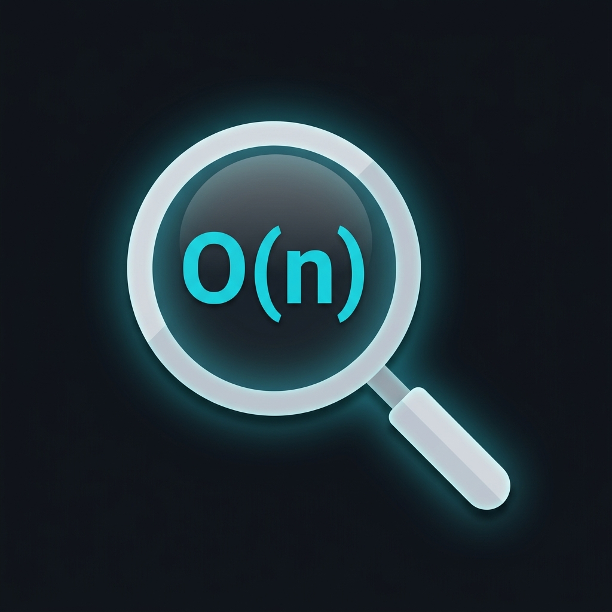

# BigO Lens

<div align="center">



### 🔍 Inline Big-O Time & Space Complexity for VS Code

**See your algorithm's complexity *as you write it*. No AI, no API keys, fully offline.**

[](https://marketplace.visualstudio.com/items?itemName=YTTHEMIGHTY.bigo-lens)
[](https://marketplace.visualstudio.com/items?itemName=YTTHEMIGHTY.bigo-lens)
[](LICENSE)
[](https://github.com/YTTHEMIGHTY/bigo-lens)

</div>

---

## ✨ Features

### 🏷️ Inline Complexity Annotations
See `⏱ O(n) 📦 O(1)` right after your function signature — no need to run anything. BigO Lens analyzes your code using **pure AST static analysis** and shows results in real-time.

### 🎨 Color-Coded Severity
Instantly know if your solution is optimal:
- 🟢 **Good** — `O(1)`, `O(log n)`
- 🟡 **Moderate** — `O(n)`, `O(n log n)`
- 🟠 **Warning** — `O(n²)`, `O(n³)`
- 🔴 **Critical** — `O(2ⁿ)`, `O(n!)`

### 📐 Smart CodeLens
Clickable complexity summary above every function with:
- Time & space complexity
- Detected algorithmic pattern
- LeetCode problem link (when applicable)

### 🏷️ Pattern Detection
Automatically identifies which algorithm technique you're using:
- 🎯 Two Pointer
- 🪟 Sliding Window
- 🔍 Binary Search
- 🌊 BFS / 🌲 DFS
- 📊 Dynamic Programming
- ✂️ Divide & Conquer
- 💰 Greedy
- ↩️ Backtracking
- #️⃣ Hash Map
- 📚 Stack / ⛰️ Heap
- And more...

### 💡 Optimization Hints
When your code exceeds the complexity threshold, BigO Lens suggests specific improvements:
```
⚠️ O(n²) detected — nested loop over same array
💡 Consider: HashMap lookup to reduce to O(n)
💡 Consider: Sorting + two pointers for O(n log n)
```

### 🔗 LeetCode Integration
If your function name matches a LeetCode pattern (e.g., `twoSum_1`, `containerWithMostWater_11`), BigO Lens:
- Links to the problem page
- Shows the **optimal** complexity
- Tells you if your solution matches ✅ or can be improved ⚠️

### 📄 Complexity Report
Generate a beautiful markdown report of all functions in your file — perfect for interview prep review.

**Command:** `BigO Lens: Export Complexity Report`

---

## 📦 Installation

### From VS Code Marketplace
1. Open VS Code
2. Press `Ctrl+Shift+X` (or `Cmd+Shift+X` on macOS)
3. Search for **"BigO Lens"**
4. Click **Install**

### From Command Line
```bash
code --install-extension YTTHEMIGHTY.bigo-lens
```

---

## 🚀 Quick Start

1. **Open any `.ts` or `.js` file** with algorithm functions
2. **Look above your function** — you'll see a CodeLens with complexity info
3. **Look at the function signature line** — inline hints show `⏱ O(n) 📦 O(1)`
4. **Hover over the function name** — see detailed breakdown
5. **Run the report command** to export a full analysis

No configuration needed — it works out of the box!

---

## ⚙️ Configuration

All settings are optional. BigO Lens works with sensible defaults.

| Setting | Default | Description |
|---------|---------|-------------|
| `bigoLens.enabled` | `true` | Enable/disable the extension |
| `bigoLens.showInlayHints` | `true` | Show inline `⏱ O(n) 📦 O(1)` annotations |
| `bigoLens.showCodeLens` | `true` | Show complexity CodeLens above functions |
| `bigoLens.showDiagnostics` | `true` | Show warning squiggles on high-complexity code |
| `bigoLens.complexityThreshold` | `O(n^2)` | Minimum complexity to trigger warnings |
| `bigoLens.showOptimizationHints` | `true` | Show optimization suggestions |
| `bigoLens.showPatternLabels` | `true` | Show detected algorithm pattern labels |
| `bigoLens.showLeetCodeLink` | `true` | Show LeetCode problem links |

### Example `settings.json`
```json
{
  "bigoLens.complexityThreshold": "O(n log n)",
  "bigoLens.showOptimizationHints": true,
  "bigoLens.showLeetCodeLink": true
}
```

---

## 🧪 How It Works

BigO Lens uses **pure AST (Abstract Syntax Tree) static analysis** — no AI, no API calls, no network requests. Everything runs locally in your editor.

### Detection Method

```
Source Code → TypeScript Compiler API → AST Walk → Pattern Matching → Big-O Result
```

The analyzer detects:

| Code Pattern | Time Complexity |
|---|---|
| Single `for`/`while` loop | O(n) |
| Nested loops (2 levels) | O(n²) |
| Nested loops (3 levels) | O(n³) |
| `.sort()` call | O(n log n) |
| Binary search (left/right/mid) | O(log n) |
| Direct recursion (no memo) | O(2ⁿ) |
| Recursion with memoization | O(n) |
| `.forEach()`, `.map()`, `.filter()` | O(n) per level |

| Allocation Pattern | Space Complexity |
|---|---|
| `new Map()` / `new Set()` | O(n) |
| `new Array(n)` | O(n) |
| 2D DP table | O(n²) |
| No extra allocations | O(1) |
| Recursive call stack | O(n) or O(log n) |

---

## 🗣️ Commands

| Command | Description |
|---------|-------------|
| `BigO Lens: Analyze Current File` | Force re-analyze the active file |
| `BigO Lens: Export Complexity Report` | Generate a markdown report |
| `BigO Lens: Toggle Inline Annotations` | Show/hide inlay hints |

---

## 🌐 Supported Languages

- ✅ TypeScript (`.ts`)
- ✅ JavaScript (`.js`)
- ✅ TypeScript React (`.tsx`)
- ✅ JavaScript React (`.jsx`)

---

## 🗺️ Roadmap

- [ ] Complexity comparison mode (multiple solutions side-by-side)
- [ ] Python support
- [ ] Java / C++ support
- [ ] Workspace-wide complexity dashboard
- [ ] Custom pattern plugins

---

## 🤝 Contributing

Contributions are welcome! See [CONTRIBUTING.md](CONTRIBUTING.md) for guidelines.

---

## 📝 Changelog

See [CHANGELOG.md](CHANGELOG.md) for the full release history.

---

## 📄 License

[MIT](LICENSE) © [Yashvardhan Thanvi](https://github.com/YTTHEMIGHTY)

---

<div align="center">

**If BigO Lens helps your DSA prep, give it a ⭐ on [GitHub](https://github.com/YTTHEMIGHTY/bigo-lens)!**

Made with ❤️ for the competitive programming and interview prep community.

</div>
